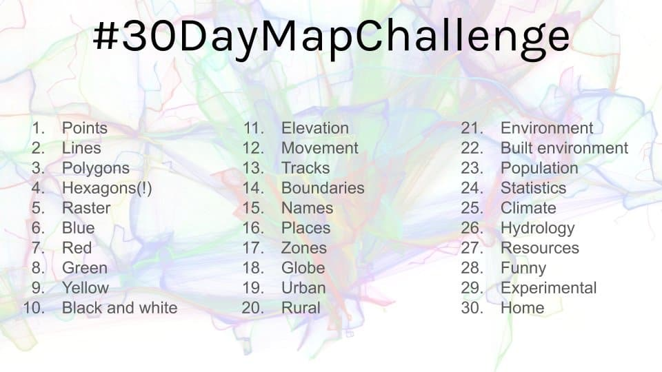

# #30daymapchallenge

Personal repository for the 2019 #30daymapchallenge.

Expect a lot of Japan-related content.

## Rules

## Viz

|  #  | Keyword           | Thema                            | Status  |
| :-: | ----------------- | -------------------------------- | ------- |
|  1  | Points            | Buddhist temples                 | Not yet |
|  2  | Lines             |                                  | Not yet |
|  3  | Polygons          | US Army implantations in Okinawa | Not yet |
|  4  | Hexagons          |                                  | Not yet |
|  5  | Raster            |                                  | Not yet |
|  6  | Blue              |                                  | Not yet |
|  7  | Red               | Fire ants                        | Not yet |
|  8  | Green             |                                  | Not yet |
|  9  | Yellow            |                                  | Not yet |
| 10  | Black and white   |                                  | Not yet |
| 11  | Elevation         | Earthquakes                      | Not yet |
| 12  | Movement          | Tokyo transportation             | Not yet |
| 13  | Tracks            | Typhoons                         | Not yet |
| 14  | Boundaries        |                                  | Not yet |
| 15  | Names             |                                  | Not yet |
| 16  | Places            |                                  | Not yet |
| 17  | Zones             |                                  | Not yet |
| 18  | Globe             |                                  | Not yet |
| 19  | Urban             |                                  | Not yet |
| 20  | Rural             |                                  | Not yet |
| 21  | Environment       |                                  | Not yet |
| 22  | Built environment |                                  | Not yet |
| 23  | Population        |                                  | Not yet |
| 24  | Statistics        |                                  | Not yet |
| 25  | Climate           |                                  | Not yet |
| 26  | Hydrology         |                                  | Not yet |
| 27  | Resources         |                                  | Not yet |
| 28  | Funny             |                                  | Not yet |
| 29  | Experimental      |                                  | Not yet |
| 30  | Home              |                                  | Not yet |
